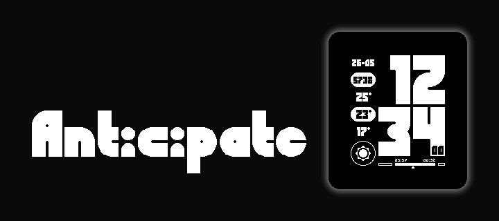

## Description

There's a time for everything! Here's a clean yet informative watch face that finds a balance between being present and being prepared.

Live in the moment while you anticipate the day ahead!

Ecclesiastes 3:1-8

## Features

- Today's date
- Step count
- Temperature (high)
- Temperature (current)
- Temperature (low)
- Current weather conditions
- Day/night timeline
  - Sunrise/sunset
  - Day/night
  - Current moment of day
- 12h and 24h time format support
- Seconds display

## Settings Options

- Date format (DD-MM or MM-DD)
- Leading zero on main time (show or hide)
- Seconds display (off, on, or temporary on motion)
- Temperature unit (Celsius or Fahrenheit)
- Update weather data interval
- Update weather data on motion toggle
- Leading zero on sunrise/sunset time labels (show or hide)
- Vibrate on motion toggle

Weather data by Open-Meteo

## Supported Platforms

- basalt
- diorite
- flint
- emery
- gabbro

## Installation

1. Ensure the Pebble SDK is installed.
2. Run `pebble build`.
3. Run `pebble install --emulator {platform-name}`.
